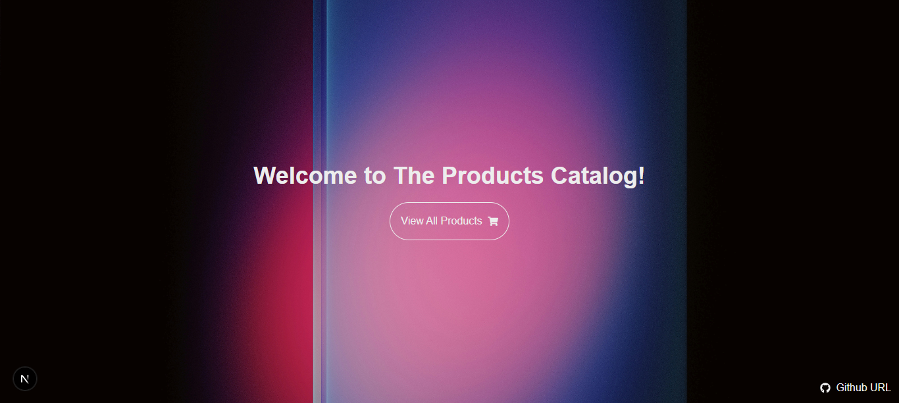
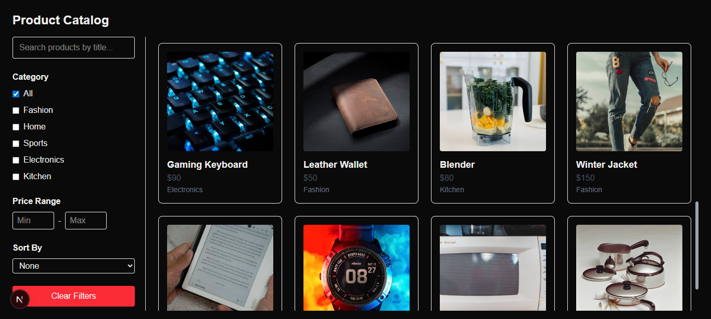
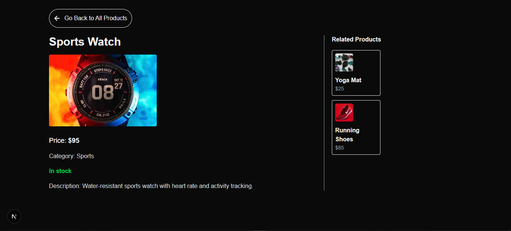

# 🛍️ Product Catalog Assignment

A modern **Product Catalog Web Application** built with **Next.js, Sanity CMS, and Tailwind CSS**.  
This project demonstrates integration of a headless CMS (Sanity) with a Next.js frontend for managing and displaying products dynamically.

## 🖼️ Screenshots of project:
### Home Page

### Products

### Single Product

---

## 🚀 Tech Stack

- **Frontend**: [Next.js](https://nextjs.org/) + [React](https://reactjs.org/)  
- **Styling**: [Tailwind CSS](https://tailwindcss.com/)  
- **CMS & Database**: [Sanity.io](https://www.sanity.io/)  
- **Deployment**: Vercel / Node.js environment  

---

## ✨ Features

- Dynamic product catalog with search & filtering  
- CMS integration for adding/editing products  
- Responsive & modern UI with TailwindCSS  
- Image handling via Sanity Asset pipeline  
- Seed script to bulk insert mock products  

---

## ⚙️ Setup Instructions

### 1️⃣ Clone the repository
git clone https://github.com/your-username/product-catalog-assignment.git
cd product-catalog-assignment

### 2️⃣ Install dependencies
npm install

### 3️⃣ Configure Environment Variables
Create a .env file in the root directory with:
NEXT_PUBLIC_SANITY_PROJECT_ID=your_project_id
NEXT_PUBLIC_SANITY_DATASET=production
NEXT_DEVELOPER_TOKEN=your_sanity_token

### 4️⃣ Run the development server
npm run dev
Now open http://localhost:3000
 in your browser 🚀

👨‍💻 Author
Developed by Muhammad Shaheem ✨